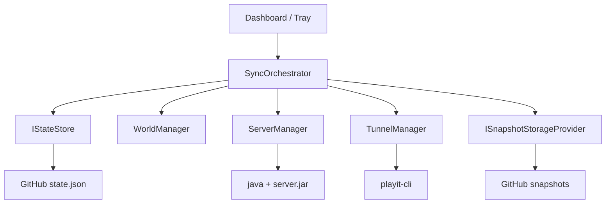
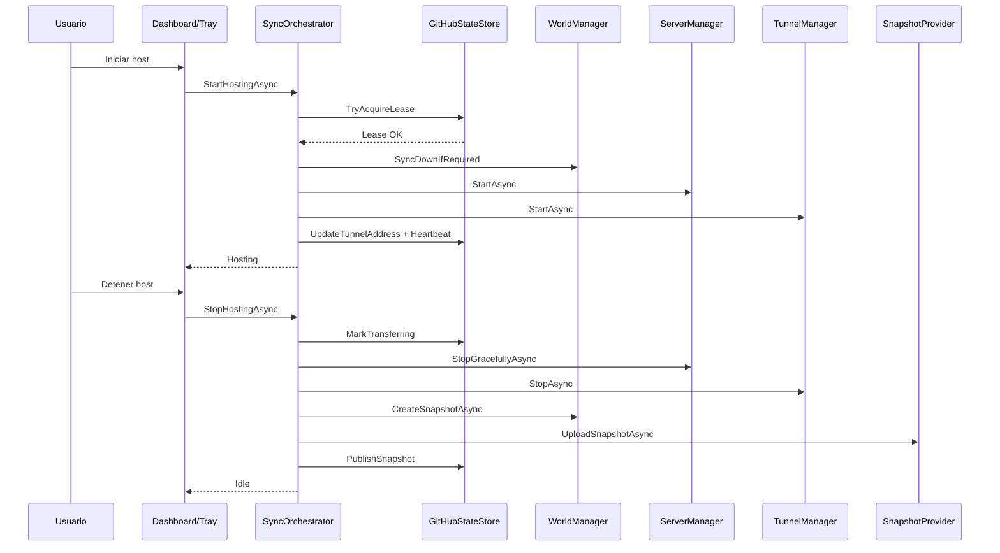

# MCSync

MCSync es una app de escritorio (C# .NET 8 + WinForms) para **rotar el host de un mundo de Minecraft Java** entre amigos con un modelo de **single-writer + lease**.

## Que resuelve

Evita el proceso manual de "me pasas el mundo por ZIP" en cada cambio de host.  
MCSync coordina automaticamente:

1. quien puede hostear en ese momento,
2. cuando bajar la ultima version consistente,
3. cuando subir el nuevo snapshot al terminar.

## Arquitectura funcional (resumen)



## Requisitos previos

1. Windows.
2. `.NET 8 SDK` (si vas a ejecutar desde código fuente).
3. `Java` instalado y accesible.
4. `server.jar` disponible localmente (descargado de la pagina oficial de [Minecraft](https://www.minecraft.net/en-us/download/server)).
5. `playit` instalado y accesible en PATH (descargado de la pagina oficial de [playit.gg](https://playit.gg/download/windows) tiene que ser el `.msi`).
6. Repositorio de GitHub privado para `state.json` y snapshots.
7. Token de GitHub con permisos de lectura/escritura al repo.

## Puesta en marcha

1. Clona el repositorio.
2. Compila:

```powershell
dotnet build --nologo
```

3. Ejecuta:

```powershell
dotnet run --project .\MCSync.csproj
```

4. Abre **CONFIGURACION** y completa como minimo:
   - GitHub owner / repo / branch / token
   - ruta de `server.jar`
   - URL de `playit.gg`
   - memoria Java minima y maxima
5. Guarda configuracion.

## Uso diario

### Iniciar host

1. Pulsa **INICIAR HOST**.
2. La app valida lease remoto.
3. Si hay snapshot remoto mas nuevo, lo descarga.
4. Prepara carpeta de servidor e inicia `server.jar`.
5. Inicia tunel y publica endpoint.

### Detener host

1. Pulsa **DETENER HOST Y SINCRONIZAR**.
2. Marca estado remoto como `Transferring`.
3. Detiene servidor y tunel.
4. Comprime mundo, calcula checksum y sube snapshot.
5. Publica nueva version y libera lease.

### Flujo de ciclo completo



## Estado del proyecto

La app esta en **fase 1 (demo funcional)**: flujo end-to-end operable, UI para uso diario y logging local.

## Documentacion por modulo

- `docs/architecture-mvp.md`: arquitectura objetivo del MVP.
- `src/Core/README.md`: orquestacion, estados y consistencia.
- `src/GitHub/README.md`: control plane y semantica de lease.
- `src/Minecraft/README.md`: ciclo local de server y snapshot.
- `src/Storage/README.md`: abstraccion y provider de snapshots.
- `src/Tunnel/README.md`: ciclo de vida de `playit-cli`.
