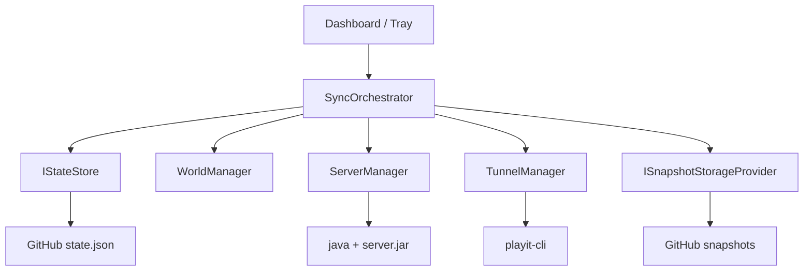
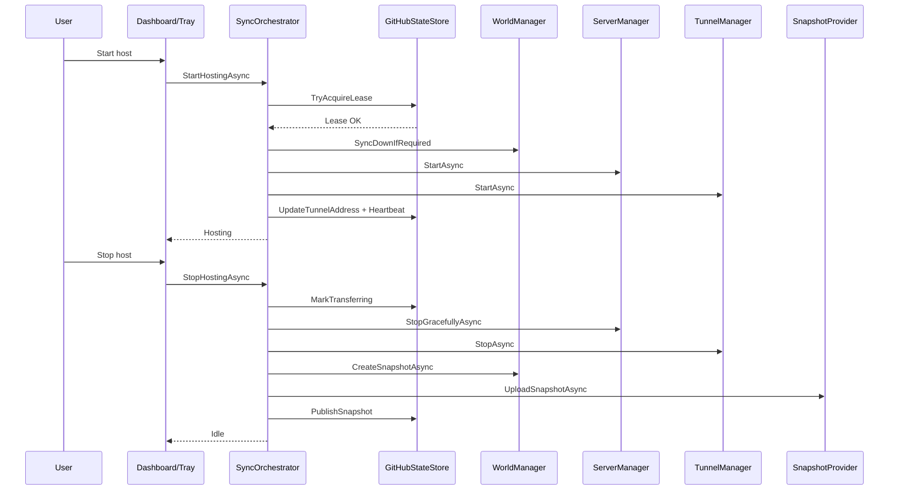

# MCSync

MCSync is a desktop app (C# .NET 8 + WinForms) for **rotating the host of a Minecraft Java world** among friends using a **single-writer + lease** model.

## What It Solves

Eliminates the manual process of "send me the world as a ZIP" every time the host changes.  
MCSync automatically coordinates:

1. who can host at any given moment,
2. when to download the latest consistent version,
3. when to upload the new snapshot after finishing.

## Functional Architecture (Summary)



## Prerequisites

1. Windows.
2. `.NET 8 SDK` (if running from source code).
3. `Java` installed and accessible.
4. `server.jar` available locally (downloaded from the official [Minecraft](https://www.minecraft.net/en-us/download/server) page).
5. `playit` installed and accessible in PATH (downloaded from the official [playit.gg](https://playit.gg/download/windows) page — must be the `.msi` installer).
6. Private GitHub repository for `state.json` and snapshots.
7. GitHub token with read/write permissions to the repo.

## Getting Started

1. Clone the repository.
2. Build:

```powershell
dotnet build --nologo
```

3. Run:

```powershell
dotnet run --project .\MCSync.csproj
```

4. Open **SETTINGS** and fill in at minimum:
   - GitHub owner / repo / branch / token
   - path to `server.jar`
   - `playit.gg` URL
   - minimum and maximum Java memory
5. Save the configuration.

## Daily Use

### Start Hosting

1. Press **START HOST**.
2. The app validates the remote lease.
3. If there is a newer remote snapshot, it downloads it.
4. Prepares the server folder and starts `server.jar`.
5. Starts the tunnel and publishes the endpoint.

### Stop Hosting

1. Press **STOP HOST AND SYNC**.
2. Marks the remote state as `Transferring`.
3. Stops the server and tunnel.
4. Compresses the world, calculates the checksum, and uploads the snapshot.
5. Publishes the new version and releases the lease.

### Full Cycle Flow



## Project Status

The app is in **phase 1 (functional demo)**: end-to-end operable flow, UI for daily use, and local logging.

## Module Documentation

- `src/Core/README.md`: orchestration, states, and consistency.
- `src/GitHub/README.md`: control plane and lease semantics.
- `src/Minecraft/README.md`: local server and snapshot lifecycle.
- `src/Storage/README.md`: snapshot abstraction and provider.
- `src/Tunnel/README.md`: `playit-cli` lifecycle.