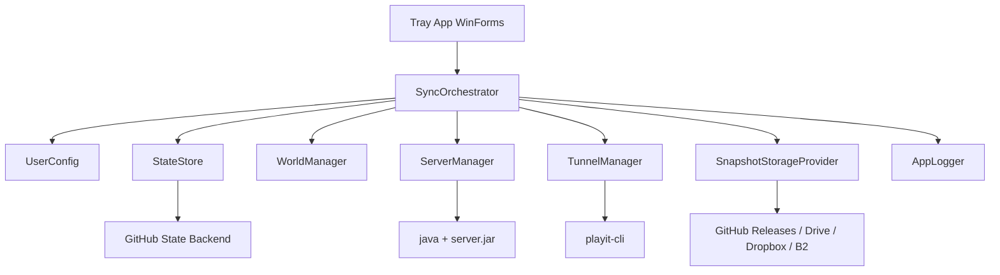
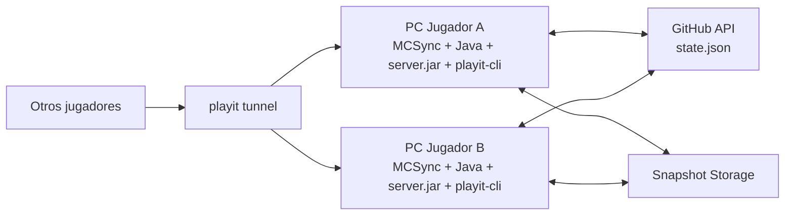

# MCSync MVP Architecture

## Objetivo

Permitir que dos o mas jugadores roten manualmente el host de un mundo de Minecraft Java Edition sin servidores dedicados propios, manteniendo:

- un solo escritor del mundo a la vez
- sincronizacion automatica al cerrar y abrir sesion
- experiencia de instalacion minima para el usuario final
- aplicacion de escritorio self-contained en C# .NET 8 para Windows

## Decisiones principales

### 1. Modelo de consistencia

Se usara `single-writer` con `lease` temporal.

- Solo un host puede estar en estado `ActiveHost`.
- El host actual renueva un heartbeat en `state.json`.
- Si otro cliente quiere tomar el rol de host, primero debe verificar que el lease este libre o expirado.
- El cambio de host siempre pasa por una ventana corta de transferencia.

Esto evita conflictos de escritura y reduce mucho la complejidad frente a modelos multi-host.

### 2. Estrategia de sincronizacion del mundo

Para el MVP se recomienda **snapshot completo comprimido**, no `zip diff`.

Motivos:

- el diff binario de un mundo de Minecraft es fragil y dificil de validar
- complica la recuperacion ante fallos
- aumenta bastante la complejidad de pruebas
- para 2-4 jugadores y mundos pequenos/medianos, un ZIP completo suele ser suficiente

`zip diff` puede evaluarse en una fase futura cuando exista telemetria real de tamanos y tiempos.

### 3. Separacion de control plane y data plane

Se recomienda separar:

- `Control plane`: coordinacion del estado compartido
- `Data plane`: almacenamiento del snapshot del mundo

Propuesta MVP:

- `state.json` en GitHub Gist privado o en un repositorio privado
- snapshot del mundo en un backend de archivos intercambiable

### 4. Backend de almacenamiento recomendado

Hay dos opciones realistas:

1. **Mas simple para demo**: GitHub para todo
   - `state.json` en Gist privado
   - ZIP del mundo como asset en Release o como blob en repo privado
   - bueno para demo y validacion inicial
   - malo para uso intensivo o mundos grandes

2. **Mas sano para producto**: GitHub para estado + Drive/Dropbox/B2 para snapshots
   - GitHub sigue coordinando
   - el mundo vive en storage pensado para archivos
   - mas escalable y mantenible

Recomendacion: empezar con opcion 1 solo si el objetivo es validar flujo rapido; para un MVP usable de verdad, prefiero opcion 2.

## Arquitectura logica



## Arquitectura de despliegue



## Maquina de estados

Estados del cliente:

- `Idle`: app abierta, no es host
- `SyncingDown`: descargando snapshot mas nuevo
- `StartingServer`: preparando carpeta y lanzando `server.jar`
- `Hosting`: servidor y tunel activos
- `StoppingServer`: enviando guardado y apagado
- `SyncingUp`: comprimiendo y subiendo snapshot
- `Error`: fallo recuperable o bloqueante

Estados globales en `state.json`:

- `Idle`: no hay host activo
- `Hosting`: existe host con lease valido
- `Transferring`: hay cierre o traspaso en curso
- `Recovering`: se detecto caida y se esta usando el ultimo snapshot consistente

## Flujo recomendado de host

### Iniciar como host

1. Leer `state.json`
2. Verificar lease:
   - si hay host activo y lease no expiro, bloquear inicio y mostrar IP actual
   - si no hay host o el lease expiro, intentar adquirirlo
3. Descargar snapshot si `worldVersion` remoto es mayor al local
4. Preparar `ServerFolder`
5. Si es primer arranque:
   - copiar `server.jar`
   - generar `eula.txt`
   - aceptar `eula=true`
6. Lanzar servidor con:

```powershell
java -Xmx4G -Xms4G -jar server.jar nogui
```

7. Esperar confirmacion de arranque
8. Lanzar `playit-cli`
9. Detectar direccion publica del tunel
10. Actualizar `state.json` con host actual, tunnel endpoint, lease y heartbeat

### Cerrar como host

1. Marcar `Transferring` en `state.json`
2. Enviar al servidor:
   - `save-off`
   - `save-all flush`
   - `stop`
3. Esperar fin del proceso
4. Comprimir `world/` a ZIP
5. Calcular checksum SHA-256
6. Subir snapshot
7. Actualizar `state.json` con nueva version, checksum, snapshot id y sin host activo
8. Cerrar `playit-cli`

## Protocolo de consistencia

### Regla de oro

El servidor solo puede estar escribiendo mundo cuando el cliente posee un lease valido.

### Campos minimos en `state.json`

```json
{
  "schemaVersion": 1,
  "worldId": "survival-main",
  "worldVersion": 12,
  "worldChecksum": "sha256:...",
  "snapshotRef": "provider-specific-ref",
  "status": "Hosting",
  "host": {
    "clientId": "client-a",
    "displayName": "Jugador A",
    "leaseId": "7ff6c0c7-9f56-41bd-a9b0-8ac6fa4ab111",
    "leaseExpiresAtUtc": "2026-04-06T18:41:00Z",
    "lastHeartbeatUtc": "2026-04-06T18:36:10Z",
    "tunnelAddress": "abc123.playit.gg:25565"
  },
  "lastUploadCompletedAtUtc": "2026-04-06T18:35:42Z",
  "lastCompletedBy": "client-a"
}
```

### Reglas adicionales

- `worldVersion` solo aumenta cuando la subida termina con exito
- nunca se debe publicar una version nueva antes de que el snapshot este completo
- si el host cae abruptamente, el sistema vuelve al ultimo snapshot confirmado
- el lease debe expirar automaticamente si no hay heartbeat

### Valores iniciales sugeridos

- heartbeat cada 10 segundos
- lease TTL de 45 segundos
- timeout de arranque del servidor de 90 segundos
- timeout de subida configurable segun tamano del mundo

## Evitar split-brain

El mayor riesgo del sistema es que dos PCs crean ser host al mismo tiempo.

Mitigaciones para MVP:

- lease con expiracion
- heartbeat periodico
- comparacion de `leaseId` antes de cada actualizacion critica
- el cliente debe auto-detener el servidor si detecta que perdio el lease
- bloqueo local de doble arranque

Mitigacion deseable:

- `fencing token`: cada adquisicion de host incrementa `hostEpoch`
- cualquier accion de host debe incluir el `hostEpoch` actual
- si el cliente detecta que su epoch ya no coincide, se apaga

## Seguridad y autenticacion

### Opcion MVP de menor friccion

- token GitHub compartido entre jugadores
- token cifrado localmente con DPAPI en `%APPDATA%`
- configuracion guiada una sola vez

Sirve para demo, pero no es ideal.

### Opcion recomendada

- GitHub OAuth Device Flow o browser-based OAuth para estado
- Google Drive o Dropbox con OAuth PKCE para snapshots
- secretos guardados localmente con DPAPI

Esto evita distribuir tokens manualmente y mejora revocacion y soporte.

### Si se quiere evitar OAuth al inicio

Alternativa pragmatica:

- aceptar un `personal access token` pegado una sola vez
- validar permisos al guardar
- ofrecer despues migracion a OAuth

## Estructura de proyecto recomendada

```text
MCSync/
|-- MCSync.csproj
|-- Program.cs
|-- docs/
|   `-- architecture-mvp.md
`-- src/
    |-- Core/
    |   |-- AppState.cs
    |   |-- UserConfig.cs
    |   |-- AppLogger.cs
    |   `-- SyncOrchestrator.cs
    |-- GitHub/
    |   |-- GitHubStateStore.cs
    |   `-- GitHubAuthProvider.cs
    |-- Storage/
    |   |-- ISnapshotStorageProvider.cs
    |   |-- GitHubReleaseStorageProvider.cs
    |   |-- DriveStorageProvider.cs
    |   `-- DropboxStorageProvider.cs
    |-- Minecraft/
    |   |-- WorldManager.cs
    |   |-- ServerManager.cs
    |   `-- ServerConsoleProtocol.cs
    |-- Tunnel/
    |   `-- TunnelManager.cs
    `-- UI/
        |-- TrayIconController.cs
        |-- SetupForm.cs
        `-- LogWindow.cs
```

## Interfaces clave

### `IStateStore`

Responsabilidades:

- leer `state.json`
- actualizar lease y heartbeat
- publicar nueva version del mundo
- intentar adquisicion de host de forma atomica

### `ISnapshotStorageProvider`

Responsabilidades:

- subir snapshot
- descargar snapshot
- verificar existencia
- devolver metadata de checksum y tamano

### `IServerManager`

Responsabilidades:

- lanzar `server.jar`
- enviar comandos a stdin
- detectar readiness
- detener de forma ordenada

### `ITunnelManager`

Responsabilidades:

- lanzar `playit-cli`
- obtener endpoint publico
- monitorear caida del tunel
- cerrar proceso

## Riesgos principales

### 1. GitHub como storage de snapshots

Riesgo:

- no esta optimizado para muchos archivos grandes ni sincronizacion frecuente

Impacto:

- tiempos altos de subida
- fallos operativos
- UX inconsistente

Mitigacion:

- usar GitHub solo como coordinador cuanto antes

### 2. Apagado inesperado del host

Riesgo:

- perder cambios desde el ultimo guardado valido

Mitigacion:

- usar `save-all flush` antes del cierre normal
- configurar autoguardado frecuente
- mostrar al usuario la hora del ultimo snapshot consistente

### 3. Dependencia de Java instalada

Riesgo:

- el usuario quiere una experiencia sin pasos extra

Mitigacion:

- detectar Java al inicio
- si no existe, ofrecer instalar o usar runtime embebido en una fase posterior

## Roadmap sugerido

### Fase 1. Demo funcional

- tray app
- host manual
- snapshot ZIP completo
- `state.json` en GitHub
- snapshot en GitHub
- playit-cli administrado por la app

### Fase 2. MVP usable

- provider de storage intercambiable
- OAuth real
- lease robusto con `hostEpoch`
- validaciones de integridad
- mejor UX de setup

### Fase 3. Robustez

- snapshots incrementales
- reintentos resumibles
- telemetria local
- selector de version de servidor
- empaquetado de Java cuando legal y tecnicamente convenga

## Recomendacion final

La idea es viable si el MVP se mantiene muy disciplinado:

- un solo escritor
- snapshot completo
- GitHub solo como coordinador idealmente
- lease con heartbeat para evitar doble host

Si intentas resolver `zip diff`, OAuth multi-provider y selector de versiones de servidor desde el dia uno, el proyecto se te va a inflar demasiado. El camino mas sano es construir primero un flujo confiable de `host -> jugar -> cerrar -> subir -> siguiente host`.
