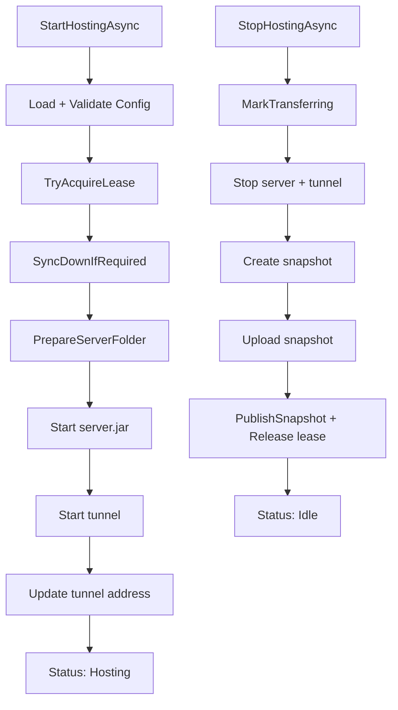

# Core

## Funcion central

`Core` implementa el **motor de orquestacion** de MCSync: define el estado global/local, carga configuracion, aplica reglas de lease y coordina el flujo completo de host.

Componentes principales:

- `SyncOrchestrator`: caso de uso principal (`start -> host -> stop -> publish`).
- `AppState` / `HostLeaseInfo`: contrato de estado remoto compartido.
- `IStateStore`: puerto para control plane remoto.
- `UserConfig` + `ConfigStore`: configuracion persistida y validacion.
- `LocalWorldStateStore`: version/checksum local aplicado.
- `AppLogger`: auditoria y eventos para UI.

## Flujo principal

## Motivo del diseno

1. **Single-writer estricto**: evita corrupcion de mundo y split-brain.
2. **Orquestador unico**: centraliza reglas de negocio y reduce logica duplicada entre UI y tray.
3. **Puertos (`IStateStore`, `ISnapshotStorageProvider`)**: permite cambiar backends sin tocar la logica de dominio.
4. **Estado explicito** (`SyncLifecycleStatus`): facilita UX, debugging y recuperacion.
