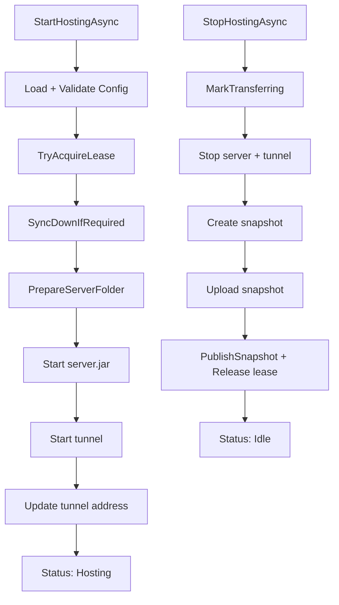

# Core

English primary documentation. Spanish version: [README.es.md](README.es.md)

## Main responsibility

`Core` contains MCSync orchestration logic: it handles config, shared/local state, lease rules, and the full host lifecycle.

Main components:

- `SyncOrchestrator`: main use case (`start -> host -> stop -> publish`).
- `AppState` / `HostLeaseInfo`: shared remote state contract.
- `IStateStore`: control-plane port.
- `UserConfig` + `ConfigStore`: persisted configuration and validation.
- `LocalWorldStateStore`: applied local version/checksum.
- `AppLogger`: audit trail and UI events.

## Main flow

