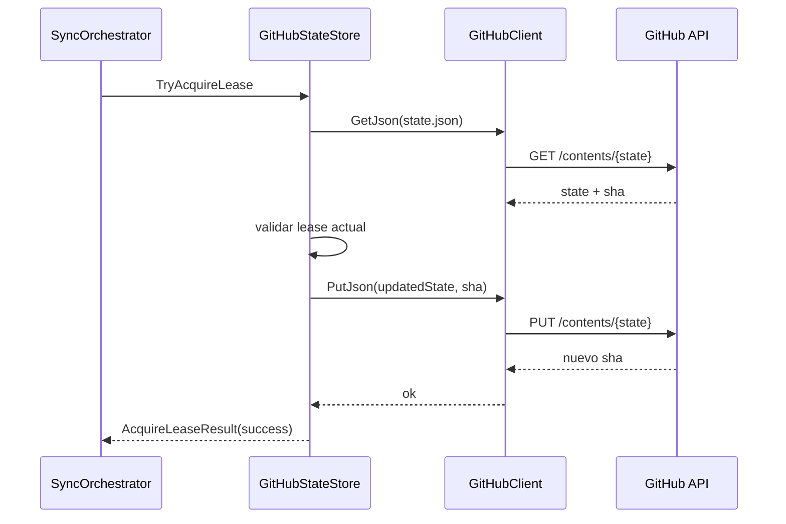
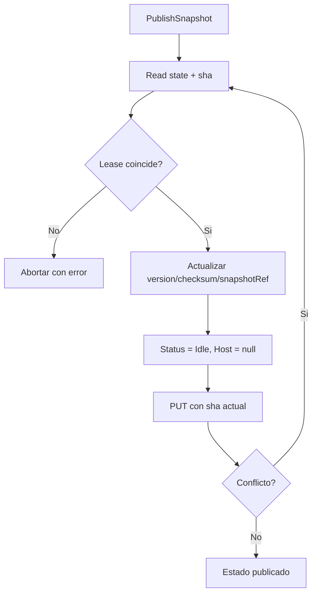

# GitHub

## Funcion central

`GitHub` implementa el **control plane remoto**: lectura/escritura de `state.json` y actualizaciones atomicas basadas en SHA para coordinar lease, heartbeat y publicacion de version.

Componentes:

- `GitHubClient`: cliente HTTP para GitHub Contents API.
- `GitHubStateStore`: implementacion de `IStateStore` con logica de lease y reintentos por conflicto.

## Flujo de lease y estado

## Publicacion de snapshot

## Motivo del diseno

1. **Control de concurrencia optimista** por SHA: evita sobrescritura ciega.
2. **Reintentos acotados**: absorbe carreras entre clientes sin bloquear indefinidamente.
3. **Lease como frontera de seguridad**: ningun cliente publica o heartbeat si no posee lease vigente.
4. **GitHub como backend MVP**: reduce friccion de despliegue para validar el flujo.
