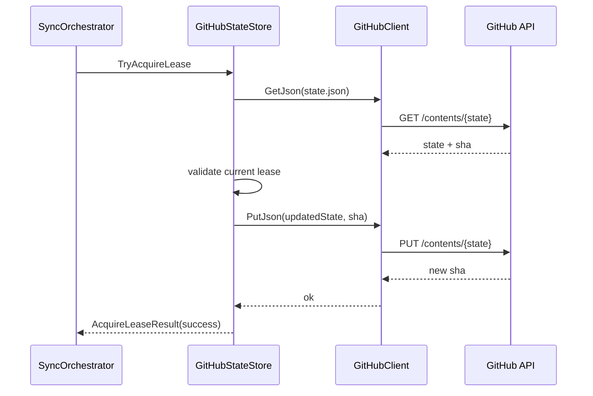
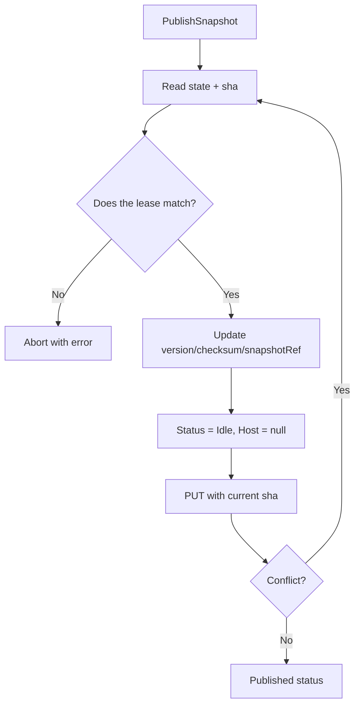

# GitHub

English primary documentation. Spanish version: [README.es.md](README.es.md)

## Main responsibility

`GitHub` implements the remote control plane: read/write `state.json` with SHA-based atomic updates for lease, heartbeat, and snapshot publication.

Components:

- `GitHubClient`: HTTP client for GitHub Contents API.
- `GitHubStateStore`: `IStateStore` implementation with lease rules and conflict retries.

## Lease and state flow

## Publish Snapshot

