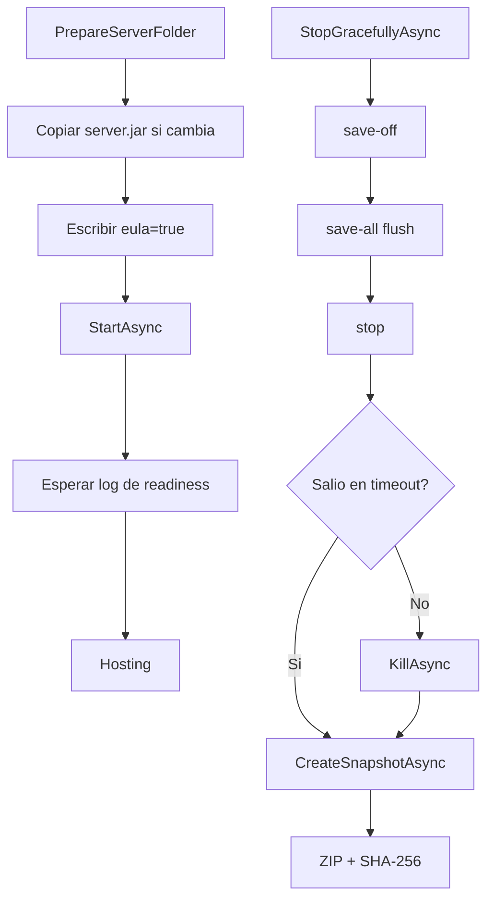

# Minecraft

## Funcion central

`Minecraft` gestiona el **data plane local del mundo** y el ciclo de vida del proceso Java:

- `ServerManager`: inicia, monitorea y detiene `server.jar`.
- `WorldManager`: prepara carpeta, extrae snapshots remotos y genera snapshots locales.

## Flujo local de arranque y cierre

## Flujo de snapshot remoto -> local

## Motivo del diseno

1. **Separar proceso Java del orchestration**: simplifica fallos y manejo de lifecycle.
2. **Snapshot completo ZIP**: estrategia robusta para MVP, facil de auditar y recuperar.
3. **Checksum SHA-256**: verifica integridad y sincronizacion local/remota.
4. **Comandos de cierre ordenado** (`save-all flush`): minimiza perdida de progreso.
