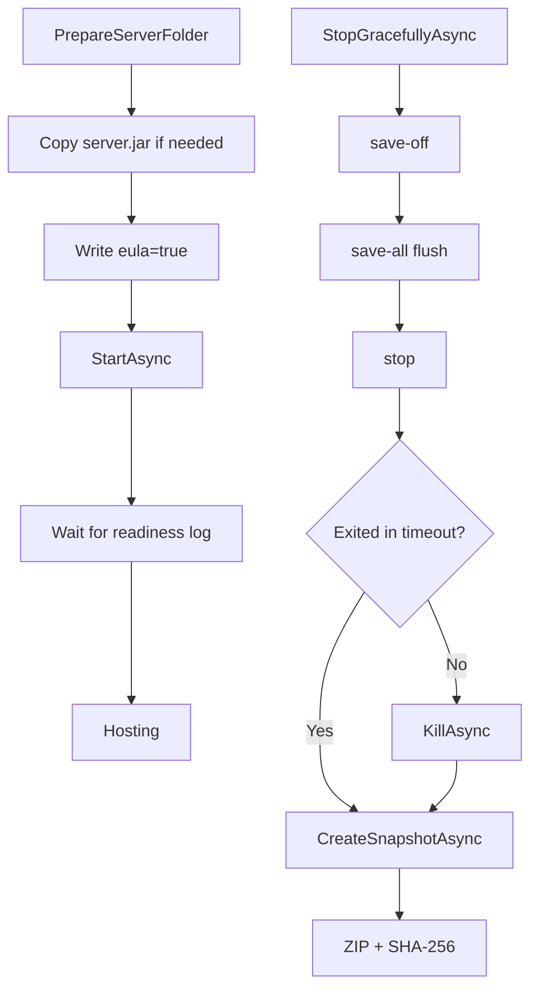

# Minecraft

English primary documentation. Spanish version: [README.es.md](README.es.md)

## Main responsibility

`Minecraft` handles the local world data plane and Java process lifecycle:

- `ServerManager`: starts, monitors, and stops `server.jar`.
- `WorldManager`: prepares folders, extracts remote snapshots, and creates local snapshots.

## Local start/stop flow

## Remote-to-local snapshot flow

