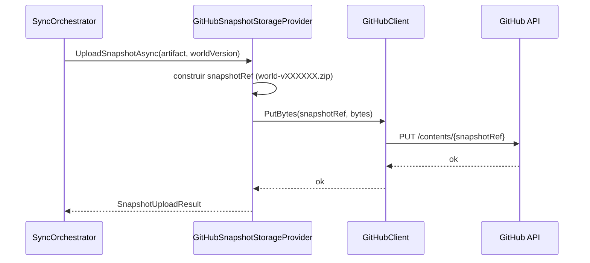
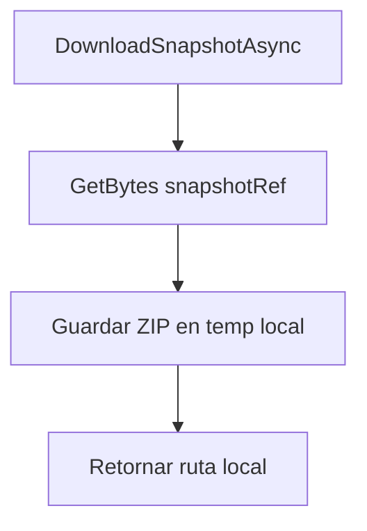

# Storage

## Funcion central

`Storage` abstrae el backend donde se guardan y recuperan snapshots del mundo.

- `ISnapshotStorageProvider`: contrato agnostico para upload/download.
- `GitHubSnapshotStorageProvider`: implementacion actual usando GitHub Contents API.

## Flujo de subida

## Flujo de descarga

## Motivo del diseno

1. **Puerto de almacenamiento**: desacopla `Core` del proveedor concreto.
2. **Ruta versionada** por `world-vNNNNNN.zip`: trazabilidad simple de snapshots.
3. **Evolucion futura**: habilita migrar a Drive/Dropbox/B2 sin rediseñar orquestacion.
