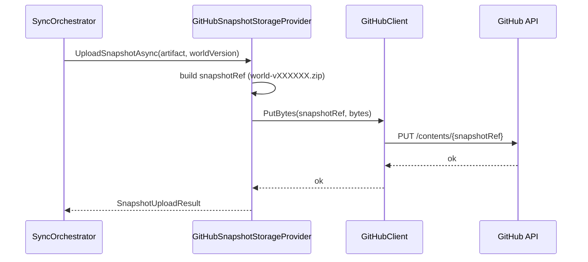
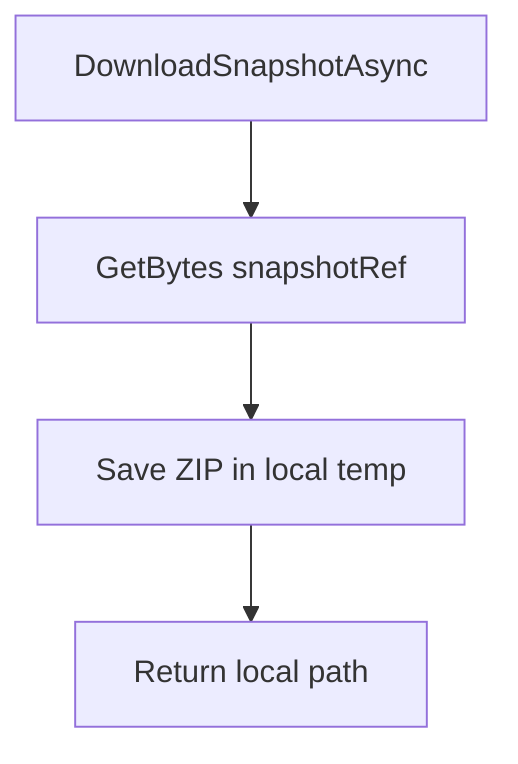

# Storage

English primary documentation. Spanish version: [README.es.md](README.es.md)

## Main responsibility

`Storage` abstracts where world snapshots are uploaded and downloaded.

- `ISnapshotStorageProvider`: provider-agnostic upload/download contract.
- `GitHubSnapshotStorageProvider`: current implementation using GitHub Contents API.

## Upload flow

## Download flow

