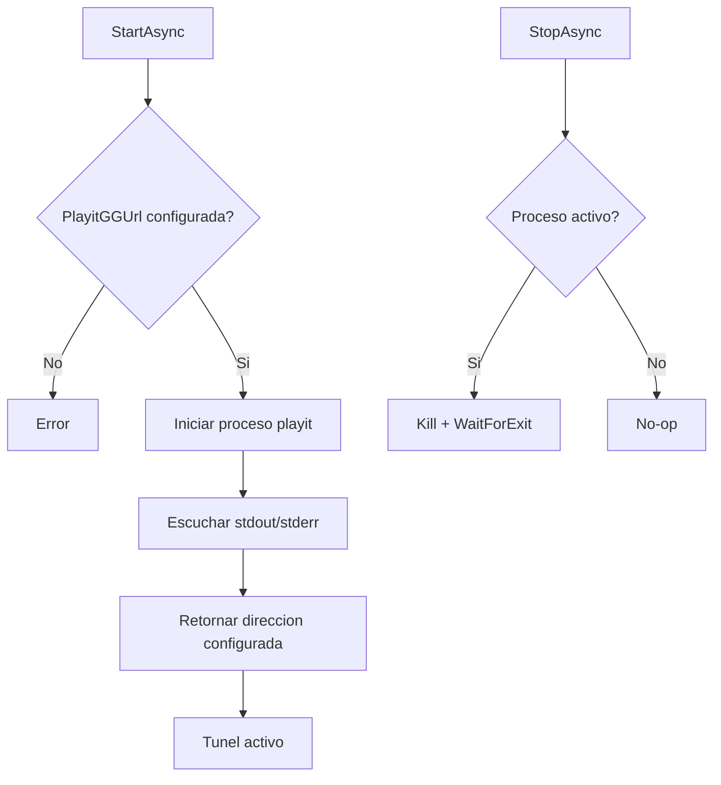

# Tunnel

## Funcion central

`Tunnel` controla el proceso de `playit-cli` para exponer el servidor local por una direccion publica durante el hosting.

Componente:

- `TunnelManager`: arranque, logging, estado y parada del proceso del tunel.

## Flujo de ciclo de vida

## Motivo del diseño

1. **Encapsulacion de proceso externo**: evita mezclar detalles de `playit` en `Core`.
2. **Interfaz minima** (start/stop): reduce superficie de error en una dependencia externa.
3. **Logging centralizado**: facilita diagnostico de conectividad y arranque.
