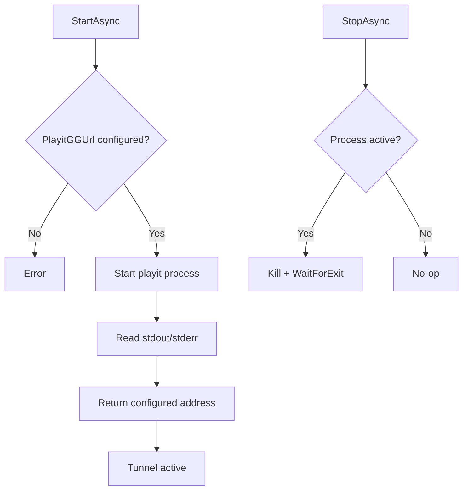

# Tunnel

English primary documentation. Spanish version: [README.es.md](README.es.md)

## Main responsibility

`Tunnel` manages the `playit-cli` process to expose the local Minecraft server through a public endpoint while hosting.

Component:

- `TunnelManager`: start, logging, state tracking, and stop logic for the tunnel process.

## Lifecycle flow

